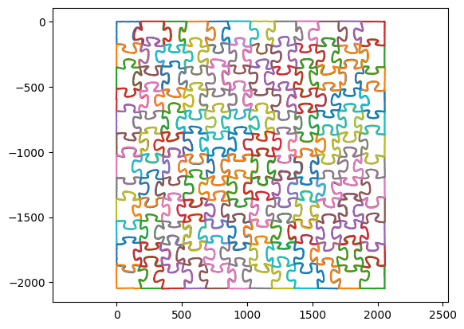

Inspired by "How to solve a white puzzle" (https://www.youtube.com/watch?v=WsPHBD5NsS0)

# Notebook
You may open this notebook and run it online on Colab.

# Input
Puzzle pieces are provided by https://www.reddit.com/r/StuffMadeHere/comments/zaq7f7/puzzle_piece_raw_image_dataset/

# Output
The program computes the position of every piece accurately.

